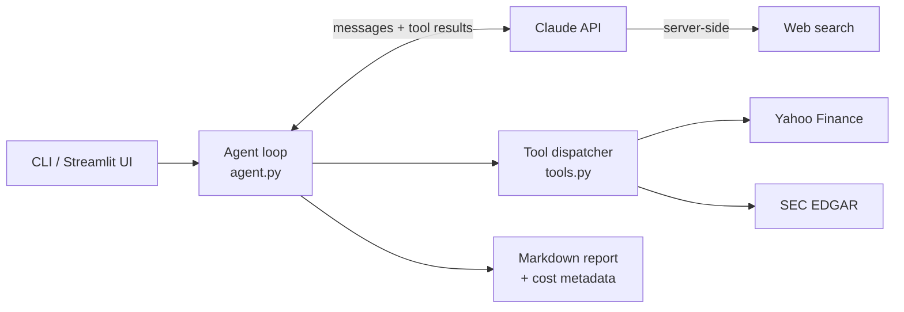

# AI Equity Research Agent

An autonomous AI agent that researches a public company the way a buy-side analyst would and writes an initiation report: business overview, multi-year financial analysis, peer valuation, bear/base/bull price scenarios, risks and catalysts, with every figure sourced.

```bash
uv run equity-research NVDA
```

Built with **Claude** (tool use + web search), **SEC EDGAR** and **Yahoo Finance**. All data sources are free; a full report costs well under a dollar in API usage and is capped by a hard spending limit.

> Educational project. The reports are not investment advice.

---

## What it does

Given a ticker, Claude plans its own research and calls tools until it has enough evidence:

| Tool | Source | Used for |
|---|---|---|
| `get_company_profile` | Yahoo Finance | Description, price, multiples, margins, analyst consensus |
| `get_financial_statements` | Yahoo Finance | Income statement, balance sheet, cash flow (annual / quarterly) |
| `get_price_performance` | Yahoo Finance | Returns vs S&P 500, volatility, drawdown, moving averages |
| `compare_peers` | Yahoo Finance | Valuation and profitability table vs competitors it selects |
| `list_sec_filings` / `read_sec_filing` | SEC EDGAR | 10-K / 10-Q sections: business, risk factors, MD&A |
| `web_search` | Claude server tool | Earnings results, guidance, news, upcoming catalysts |

It then writes a structured Markdown report (see [`sample_reports/`](sample_reports/)).

## Architecture



- **`agent.py`**: a hand-written tool-use loop rather than a framework, so every step is visible: parallel tool calls, `pause_turn` handling for server-side search, refusal handling, and cost accounting per turn.
- **`data.py`**: data access. Filing HTML is converted to text and split into sections (risk factors, MD&A) with regexes that cope with real-world formatting quirks, such as headings split across HTML tags (`RIS K FACTORS`) and table-of-contents entries that repeat each heading.
- **`tools.py`**: JSON-schema tool definitions plus a dispatcher that returns errors to the model so it can adapt (for example, a non-US company with no 10-K).
- **`prompts.py`**: the analyst instructions and report template.

## Cost engineering

API spend was a design constraint, not an afterthought:

- **Prompt caching.** Each loop iteration resends the conversation, and caching bills those repeated tokens at about 5% of the normal input price.
- **Compact tool outputs.** Statements are trimmed to the key line items, filings are paginated at 12k characters, and numbers are pre-formatted (`331.84B`).
- **Hard budget.** Once spending reaches 80% of the cap (default **$1.00**), the agent is told to stop researching and, with tool use disabled, writes the report from what it has.
- **Bounded search.** Web searches are capped per report (default 5).
- **Model choice.** Claude Sonnet 5.5 is the default: strong analysis at half the per-token price of Opus 5.5. Switch to Opus 5.5 for the deepest reports or Haiku 4.5 for the cheapest.
- **Transparent.** Running cost is printed live, and every saved report records its model, token counts and cost.

## Quickstart

Requires [uv](https://docs.astral.sh/uv/) (it installs Python 3.12 automatically) and an [Anthropic API key](https://console.anthropic.com/).

```bash
git clone <your-repo-url> && cd equity-research-agent
uv sync
cp .env.example .env        # then add your API key and contact email
uv run equity-research MSFT
```

Options:

```bash
uv run equity-research AAPL --effort low --max-cost 0.50     # cheaper, faster
uv run equity-research AAPL --model claude-opus-5-5          # best quality, ~2x cost
uv run equity-research AAPL --out sample_reports             # add to the demo gallery
```

Web UI:

```bash
uv run streamlit run app.py
```

## Free public demo

The Streamlit app has two modes:

- **Sample reports** shows pre-generated reports from `sample_reports/`. It makes no API calls, so a public link can't run up your bill.
- **Live research** runs the agent. With no server key configured, visitors paste their own API key, which stays in their browser session.

To deploy for free on [Streamlit Community Cloud](https://streamlit.io/cloud):

1. Push this repo to GitHub.
2. Create an app pointing to `app.py`.
3. Leave `ANTHROPIC_API_KEY` **unset** in the app's secrets so visitors use sample mode or their own key.
4. Optionally set `REPO_URL` to show a source-code link in the sidebar.

## Tests

```bash
uv run pytest
```

The agent-loop tests use a scripted fake Claude client. They cover tool round-trips, budget wrap-up, `pause_turn` resumption, refusals and the cost math, and they run offline at no cost.

## Limitations

- Yahoo Finance data is unofficial and occasionally missing fields; the agent marks gaps as n/a.
- Filing section extraction is heuristic. Some companies (JPMorgan, for example) file their MD&A as an exhibit, and the tool tells the agent to fall back to the full text.
- SEC EDGAR covers only US-registered filers.
- Reports can contain errors, like any analyst draft. Verify before relying on them.

## Ideas for extension

- XBRL "company facts" from EDGAR for 10+ years of standardized financials
- Earnings-call transcript analysis
- A simple DCF tool so valuation arithmetic runs in code rather than in the model
- An evaluation set that checks report numbers against source data
