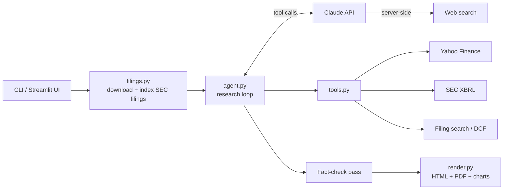

# AI Equity Research Agent

An autonomous AI agent that does buy-side due diligence on a public company. It downloads the company's SEC filings, researches it the way an analyst would, fact-checks its own work, and delivers an **investment memo** as a styled web page and PDF with charts.

```bash
uv run equity-research NVDA
```

**[▶ Live demo](https://renzo-equity-research.streamlit.app/)** · **Sample output:** [NVIDIA memo](sample_reports/NVDA_memo_2026-10-03.pdf) · [Microsoft memo](sample_reports/MSFT_memo_2026-10-03.pdf)

Built with **Claude** (tool use, web search), **SEC EDGAR** and **Yahoo Finance**. All data sources are free. A full memo costs about **$0.40–0.50** in API usage, and a hard spending cap limits every run.

> Educational project. The memos are not investment advice.

---

## What it does

1. **Downloads the filings** before any paid step, so this part costs nothing:
   - the last 3 annual reports (10-K) and the last 4 quarterly reports (10-Q)
   - 12 current reports (8-K) with their earnings press releases
   - the proxy statement (executive pay and governance)
   - a year of insider trades (Form 4)

   For NVIDIA or Microsoft that's about 30 documents.
2. **Researches ten areas.** Claude decides which tools to call, and in what order:

| Tool | Source | Used for |
|---|---|---|
| `get_company_profile` | Yahoo Finance | Price, valuation multiples, margins, balance sheet |
| `get_financial_history` | SEC XBRL | 10 years of financials as reported to the SEC |
| `get_financial_statements` | Yahoo Finance | Latest quarterly income, balance sheet and cash flow |
| `get_analyst_estimates` | Yahoo Finance | Consensus EPS and revenue, estimate revisions, price targets |
| `compare_peers` | Yahoo Finance | Valuation and profitability against competitors the agent picks |
| `search_filings` | Downloaded filings | BM25 keyword search across every downloaded filing |
| `read_filing` | Downloaded filings | Sections of a filing (business, risk factors, MD&A), paginated |
| `get_insider_activity` | SEC Form 4 | Insider buying and selling, with grants and tax withholding separated out |
| `run_dcf` | Computed in code | Bear / base / bull DCF with a sensitivity table |
| `web_search` | Claude server tool | Earnings calls, guidance, news |

3. **Fact-checks itself.** After the draft, a second pass re-checks every number against the tool results and fixes anything unsupported or inconsistent. Its corrections are listed in the memo. On the NVIDIA memo it caught 12 issues, including mis-cited filings, unsupported claims and opinions presented as facts. On the Microsoft memo it caught 8, including arithmetic slips.
4. **Renders the memo** as HTML and PDF, with summary cards and six charts:
   - price against the S&P 500
   - peer multiples
   - 10-year revenue and margin
   - free cash flow against net income
   - DCF scenario values
   - a DCF sensitivity heatmap

**Memo structure:** recommendation and thesis · company overview · industry and competitive position · financial analysis · management, governance and capital allocation · valuation · variant perception · risks · catalysts · what would change our mind · sources.

## Architecture



| File | Role |
|---|---|
| `agent.py` | A hand-written tool-use loop (no framework): parallel tool calls, `pause_turn` resumption, refusal handling, per-turn cost accounting, and a separate fact-check phase |
| `filings.py` | EDGAR downloader, BM25 filing search, XBRL 10-year history, Form 4 parser, DCF engine |
| `data.py` | Yahoo Finance tools; filing HTML-to-text conversion and section extraction |
| `render.py` | Markdown to HTML with matplotlib SVG charts; PDF through headless Chrome |
| `prompts.py` | The analyst instructions and memo template |

### Real-world data problems this handles
- **XBRL tag changes.** Companies change the names they use for figures. NVIDIA moved revenue from `RevenueFromContractWithCustomer…` to `Revenues` and reports capex as `PaymentsToAcquireProductiveAssets`. The tool merges the alternatives so the 10-year history has no gaps.
- **Messy filing HTML.** Headings can be split across HTML tags (`RIS K FACTORS`), table-of-contents entries repeat each heading, and filings cross-reference "Item 1A" in running text. Section extraction handles all three.
- **Inconsistent exhibit names.** Press releases aren't always named `ex99`; NVIDIA uses `q2fy27pr.htm`. The downloader looks for exhibits by content rather than file name.
- **Conflicting sources.** When Yahoo's TTM free cash flow disagrees with the cash flow statement, the agent flags it rather than picking one silently.

## Cost engineering
- **Free work first.** Downloading, searching and the DCF math run locally, so no tokens are spent on them.
- **Search instead of read.** Filings total about 3 million characters per company. The agent retrieves only the passages it needs.
- **Prompt caching.** The growing conversation is re-read from cache at about 10% of the normal input price.
- **Hard budget.** At 70% of the cap the agent stops researching and writes the memo; the remaining 30% is reserved for the fact-check pass. The default cap is $1.50.
- **Model choice.** Claude Sonnet 5.5 is the default. `--deep` switches to Claude Opus 5.5 at high effort for showcase memos.

## Quickstart

Requires [uv](https://docs.astral.sh/uv/) and an [Anthropic API key](https://console.anthropic.com/).

```bash
git clone https://github.com/aldanar304-code/Equity-Research-Agent-.git && cd Equity-Research-Agent-
uv sync
cp .env.example .env            # add ANTHROPIC_API_KEY (and a contact email for the SEC)
uv run equity-research MSFT     # writes reports/MSFT_memo_<date>.html / .pdf / .md
```

Options: `--deep` (Opus, high effort), `--max-cost 0.75`, `--effort low|medium|high`, `--no-fact-check`, `--out folder`.

Web UI: `uv run streamlit run app.py`. It has two modes. **Sample memos** makes no API calls, so it's safe as a public demo. **Live research** uses the server's key or the visitor's own.

## Tests

```bash
uv run pytest
```

The agent-loop tests use a scripted fake Claude client and run offline at no cost. They cover tool round-trips, budget wrap-up, `pause_turn`, refusals, the fact-check phase, cost math and the DCF math.

## Limitations
- Yahoo Finance data is unofficial and sometimes conflicts with filings; the memo discloses any conflicts it finds.
- SEC EDGAR covers only US-registered filers.
- XBRL EPS and share counts are as reported, not adjusted for later stock splits.
- Like any analyst draft, a memo can contain errors. Verify before relying on it.
